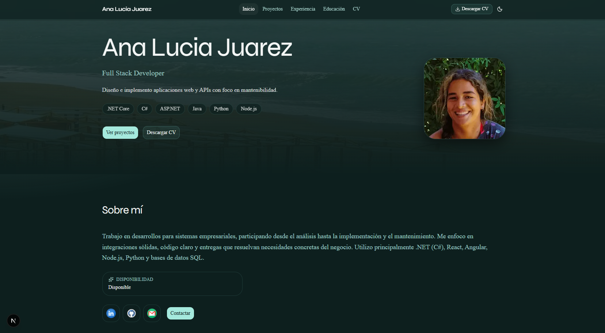
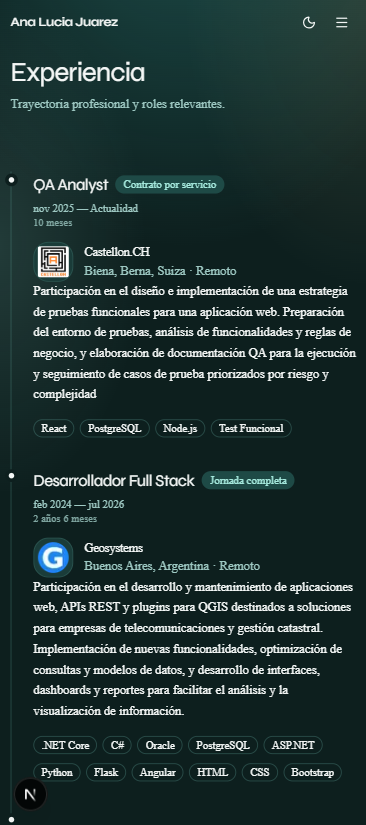
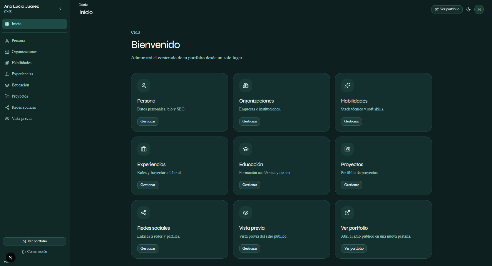

# PortfolioCMS

<p align="center">
  
</p>

<p align="center">
  
  
  
  
  
</p>

Portfolio público con panel de administración para **un único administrador**. El contenido se gestiona desde Supabase (Postgres, Auth, Storage y RLS).

---

## Índice

- [Acerca del proyecto](#acerca-del-proyecto)
- [Programas y software requerido](#programas-y-software-requerido)
- [Preparar el ambiente (paso a paso)](#preparar-el-ambiente-paso-a-paso)
- [Base de datos: correr migraciones](#base-de-datos-correr-migraciones)
- [Compilar proyecto localmente](#compilar-proyecto-localmente)
- [Funcionalidades](#funcionalidades)
- [Tecnologías utilizadas](#tecnologías-utilizadas)
- [Sitio web online](#sitio-web-online)
- [Capturas](#capturas)
- [Autor](#autor)

---

## Acerca del proyecto

**PortfolioCMS** es un portfolio profesional personal con CMS integrado. No es un producto multi-tenant ni un SaaS: un solo admin gestiona todo el contenido.

Incluye:

- Portfolio público (hero, sobre mí, habilidades, experiencia, educación, proyectos y CV)
- Panel `/admin` con Welcome Hub y CRUD tipado (React Hook Form + Zod)
- Preview del sitio reutilizando los mismos componentes públicos
- Autenticación con Supabase + tabla `admins` + email admin en variables de entorno
- Skills destacadas para el Hero, agrupadas por tipo y ordenadas alfabéticamente
- Descarga de CV en PDF (`@react-pdf/renderer`)

---

## Programas y software requerido

| Software | Versión / notas |
|---|---|
| [Node.js](https://nodejs.org/) | 20 o superior (recomendado LTS / 22+) |
| npm | Incluido con Node.js |
| Cuenta en [Supabase](https://supabase.com) | Proyecto cloud (no hace falta Docker) |
| Editor de texto | Para editar `.env.local` (VS Code, Cursor, etc.) |
| Git | Para clonar el repositorio |

---

## Preparar el ambiente (paso a paso)

### 1. Clonar e instalar

```bash
git clone https://github.com/manita02/PortfolioCMS.git
cd PortfolioCMS
npm install
npm run setup
```

`npm run setup` crea `.env.local` desde `.env.example` si aún no existe.

### 2. Crear proyecto en Supabase

1. Entrá a [supabase.com/dashboard](https://supabase.com/dashboard)
2. **New project** → nombre, contraseña de DB y región
3. Esperá a que el proyecto quede **Active**

### 3. Completar variables de entorno

En el dashboard: **Project Settings → API**

Editá `.env.local`:

| Variable | Dónde sacarla |
|---|---|
| `NEXT_PUBLIC_SUPABASE_URL` | Project URL |
| `NEXT_PUBLIC_SUPABASE_ANON_KEY` | `anon` / `public` |
| `ADMIN_EMAIL` | Email con el que vas a iniciar sesión |
| `NEXT_PUBLIC_ADMIN_EMAIL` | **El mismo** email |
| `NEXT_PUBLIC_SITE_URL` | En local: `http://localhost:3000` |

Ejemplo:

```env
NEXT_PUBLIC_SUPABASE_URL=https://abcdefgh.supabase.co
NEXT_PUBLIC_SUPABASE_ANON_KEY=eyJhbGciOi...
ADMIN_EMAIL=tu@email.com
NEXT_PUBLIC_ADMIN_EMAIL=tu@email.com
NEXT_PUBLIC_SITE_URL=http://localhost:3000
```

> No uses `SUPABASE_SERVICE_ROLE_KEY` en esta app. Toda la autorización pasa por RLS + email admin.

### 4. Crear el usuario admin

1. Dashboard → **Authentication → Providers → Email**
   - Desactivá **Enable email confirmations** (más fácil en local)
   - Opcional: desactivar signups públicos
2. **Authentication → Users → Add user**
   - Email = el de `.env.local`
   - Password = la que quieras
   - Marcá **Auto Confirm User**
3. Copiá el **User UID**
4. En SQL Editor, abrí `supabase/setup_admin.sql`, reemplazá UUID y email, y ejecutá

---

## Base de datos: correr migraciones

En Supabase: **SQL Editor → New query**

Ejecutá **en este orden**, pegando el contenido completo de cada archivo (Run en cada uno):

1. `supabase/migrations/0001_init_schema.sql`
2. `supabase/migrations/0002_rls_policies.sql`
3. `supabase/migrations/0003_storage_buckets.sql`
4. `supabase/migrations/0004_indexes.sql`

Si todo sale bien, no debería haber errores.

### Seed (datos de demo, opcional)

En el mismo SQL Editor, ejecutá `supabase/seed.sql`.

Vas a ver persona, organizaciones, skills, experiencias y proyectos de ejemplo.

---

## Compilar proyecto localmente

### Modo desarrollo

```bash
npm run dev
```

Abrí el portfolio en: http://localhost:3000

### Modo producción local

```bash
npm run build
npm run start
```

Misma URL: http://localhost:3000

---

## Funcionalidades

### Portfolio público

- Hero con nombre, título, subtítulo y skills **destacadas**
- Sección Sobre mí + redes sociales
- Habilidades agrupadas por tipo (orden alfabético por nombre)
- Experiencia laboral y educación
- Listado y detalle de proyectos con filtro por skill
- CV web y descarga en PDF
- SEO básico (metadata, sitemap, robots, JSON-LD)

### Panel de administración (`/admin`)

- Login seguro (solo el email admin autorizado)
- Welcome Hub con acceso a cada módulo
- CRUD de: Persona, Organizaciones, Habilidades, Experiencias, Educación, Proyectos, Redes sociales
- Checkbox **Destacada** en habilidades (aparecen en el Hero)
- Carga de medios a Supabase Storage
- Preview del portfolio con los componentes reales

---

## Tecnologías utilizadas

<p align="center">
  <table>
    <tr>
      <td align="center" width="120">
        <br />
        <b>Next.js 15</b>
      </td>
      <td align="center" width="120">
        <br />
        <b>React 19</b>
      </td>
      <td align="center" width="120">
        <br />
        <b>TypeScript</b>
      </td>
      <td align="center" width="120">
        <br />
        <b>Tailwind CSS 4</b>
      </td>
    </tr>
    <tr>
      <td align="center" width="120">
        <br />
        <b>Supabase</b>
      </td>
      <td align="center" width="120">
        <br />
        <b>PostgreSQL</b>
      </td>
      <td align="center" width="120">
        <br />
        <b>Node.js</b>
      </td>
      <td align="center" width="120">
        <br />
        <b>shadcn/ui</b>
      </td>
    </tr>
    <tr>
      <td align="center" width="120">
        <br />
        <b>Zod</b>
      </td>
      <td align="center" width="120">
        <br />
        <b>React Hook Form</b>
      </td>
      <td align="center" width="120">
        <br />
        <b>Framer Motion</b>
      </td>
      <td align="center" width="120">
        <!-- celda vacía para mantener la grilla -->
      </td>
    </tr>
  </table>
</p>

También: `@react-pdf/renderer` (CV PDF), Base UI, Sonner (toasts), next-themes.

---

## Sitio web online

[Visitar sitio](https://portfolio-cms-mocha.vercel.app)

---

## Capturas

### Portfolio


### Vista mobile



### Panel admin




---

## Autor

| [<br><sub>Ana Lucia Juarez</sub>](https://github.com/manita02) |
| :---: |
